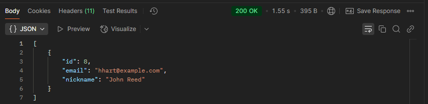
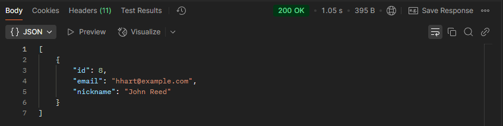
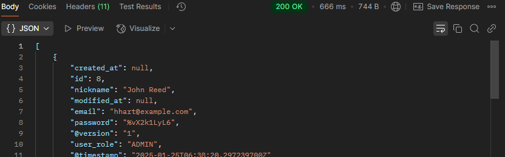
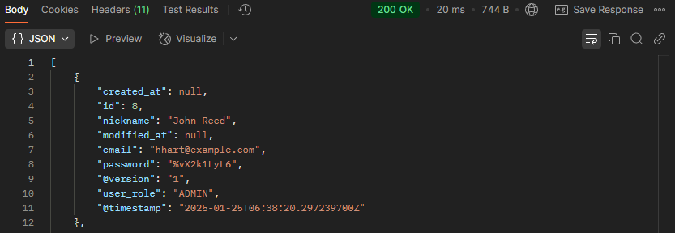

# SPRING PLUS

---

## 레벨 별 현황

### 1. 코드 개선 퀴즈 - @Transactional의 이해 ✅

### 2. 코드 추가 퀴즈 - JWT의 이해 ✅

### 3. 코드 개선 퀴즈 - AOP의 이해 ✅

### 4. 테스트 코드 퀴즈 - 컨트롤러 테스트의 이해 ✅

### 5. 코드 개선 퀴즈 - JPA의 이해 ✅

### 6. JPA Cascade ✅

### 7. N+1 ✅

### 8. QueryDSL ✅

### 9. Spring Security ✅

### 10. QueryDSL 을 사용하여 검색 기능 만들기 ✅

### 11. Transaction 심화 ✅

### 12. AWS 활용 마스터 ❌

### 13. 대용량 데이터 처리 ✅

### 14. Entity 및 Repository CRUD 리팩토링(Kotlin) ❌

----

## 대용량 데이터 처리 검색 비교

### - 일반 SELECT 문

> 최초 조회

> 2번째 조회

---

### - ElasticSearch (FULLTEXT)

> 최초 조회
>

> 2번째 조회
>

|          | SELECT | ELASTICSEARCH(FULLTEXT) | 속도 차이                                         |
|----------|--------|-------------------------|-----------------------------------------------|
| 최초 조회 시  | 1.55s  | 686ms                   | 약 2.26배                                       |
| 2번째 조회 시 | 1.05s  | 20ms                    | ⭐**52.5배** |

